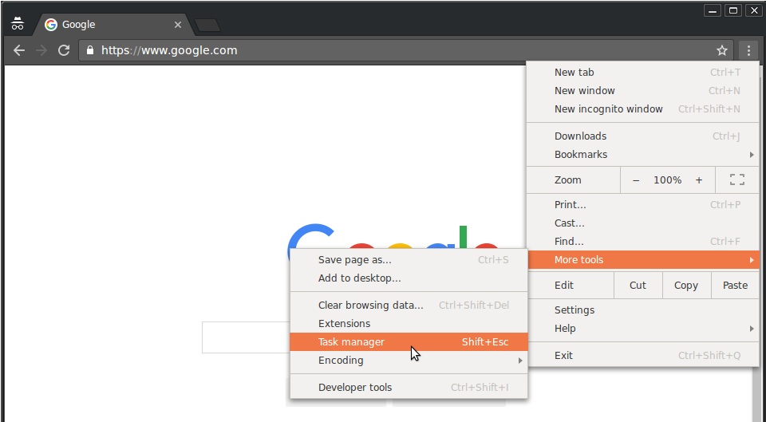
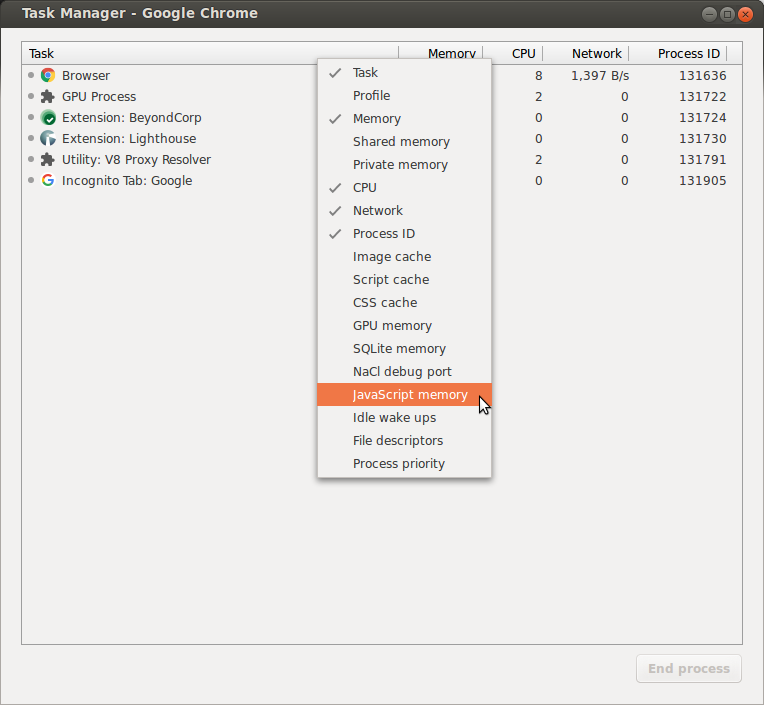
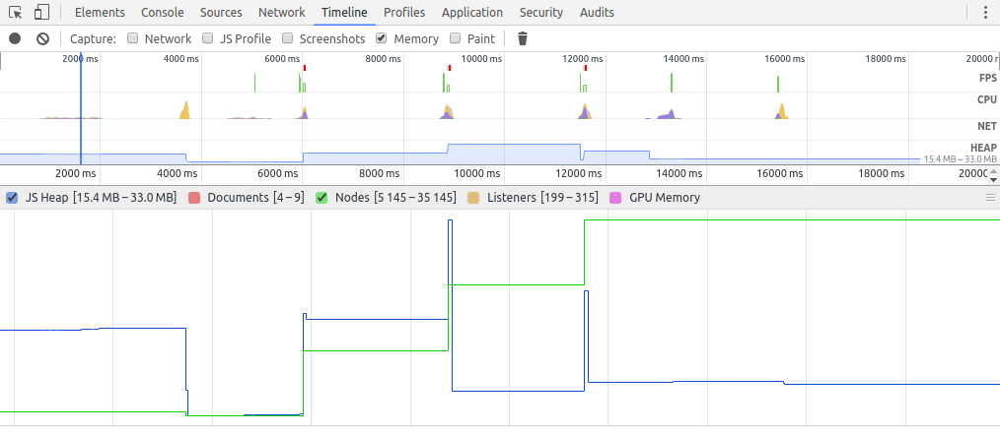
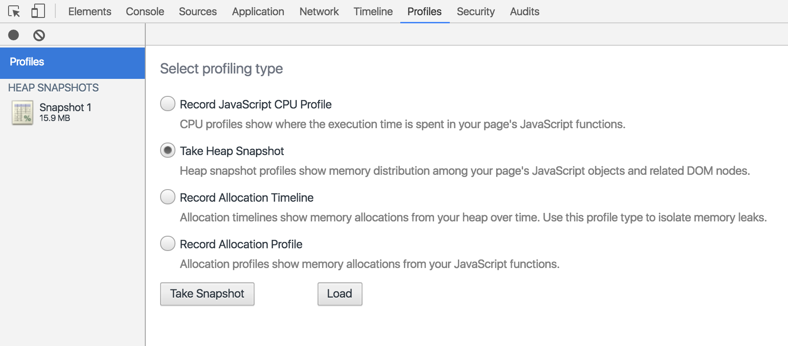
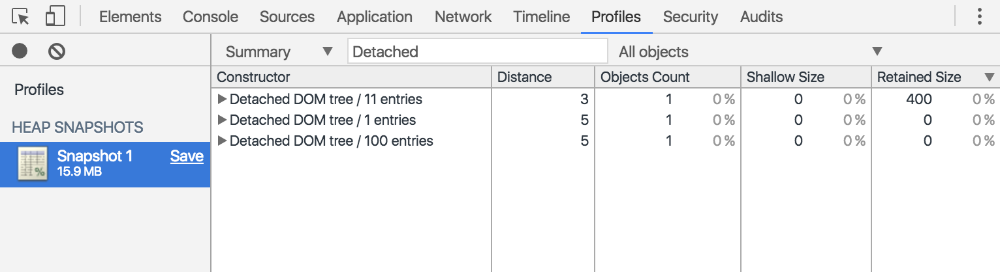
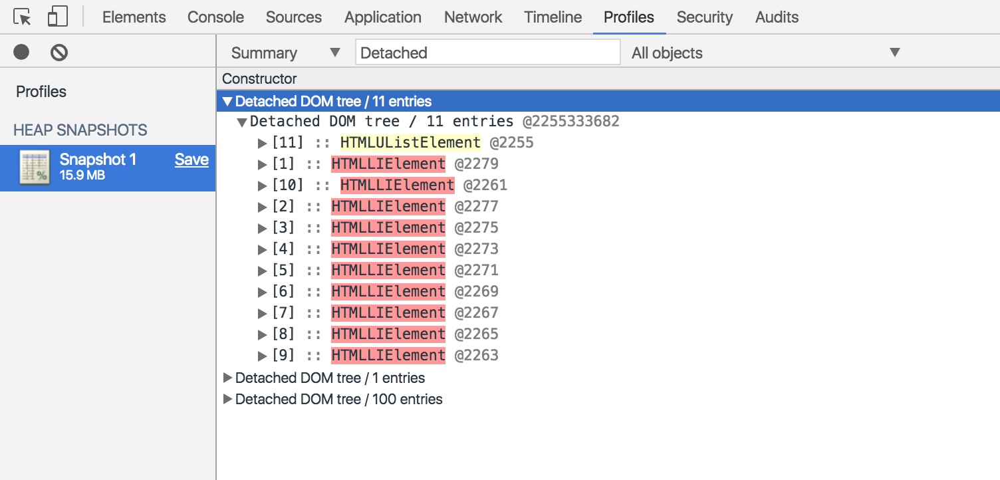
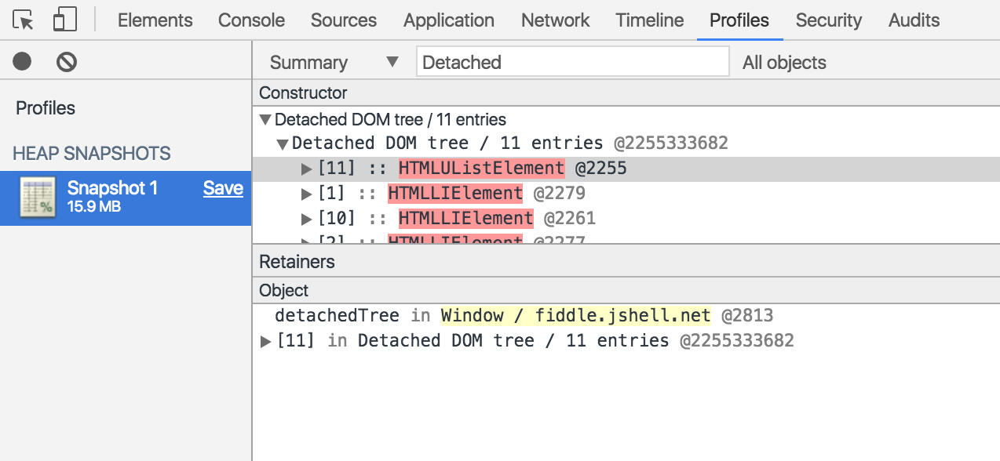
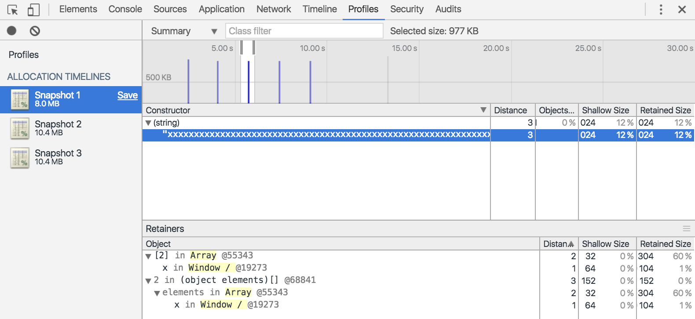
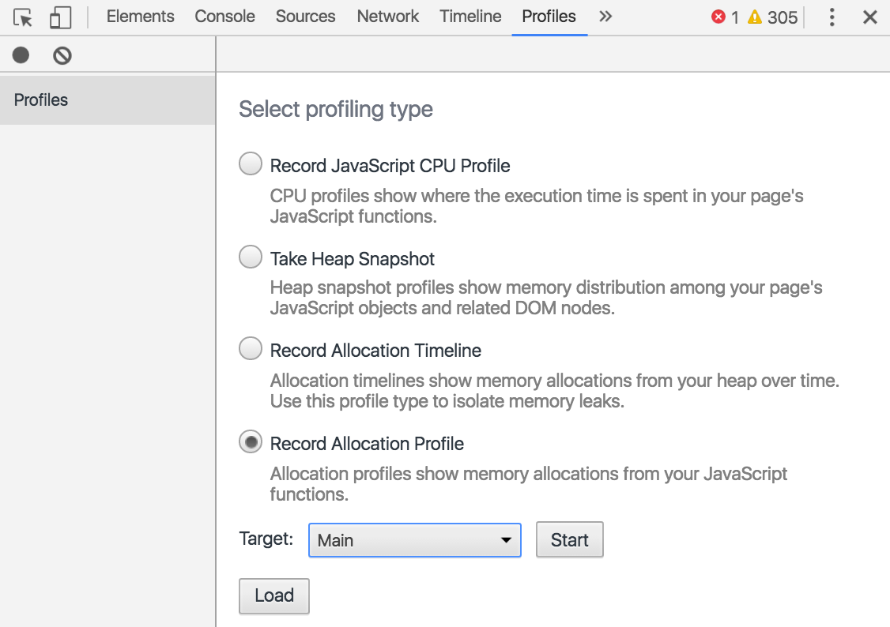
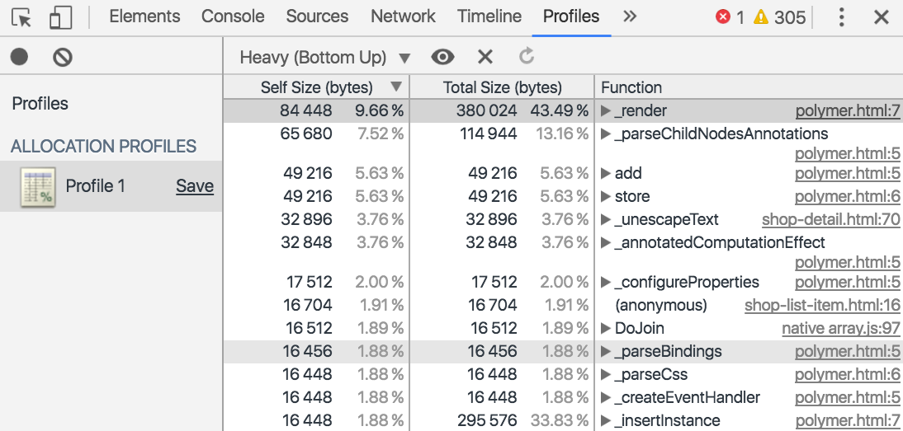

<style>
h1 {
    color:white;
    background:#7ab6df;
    width:100%;
    padding-left:0.5em;
    padding:auto;
    font-size:3em;
    font-weight:bold;
    letter-spacing:0.01em
 }
h2 {
    color:#7ab6df;
    background:#ffffff;
    font-weight:bold;
    width:100%;
    padding:5px;
    font-size:30px;
    letter-spacing:0.01em;
    border-bottom:1px solid #7ab6df!important;
    margin-top: 40px;
    margin-bottom:40px;
}
h3 {
    color:#7ab6df;
    background:#ffffff;
    width:100%;
    padding:3px;
    font-size:20px;
    font-weight:bold;
    border-bottom:1px solid #7ab6df!important;
    letter-spacing:0.01em;
}
pre {
    background:#e1f0fa!important;
    border: 1px solid #8ac6ef
}
code {
    color:#222;
    font-size:1em;
    font-weight:300;
}

blockquote {
    padding: 1em!important;
    color: #000!important;
    border-left: 0.25em solid #ce7206!important;
    background:#fbebc0;
}
ul {margin:1em}
li{margin:0.5em}
</style>


# Solucionar problemas de memoria que afectan al rendimiento

Esta guía te enseña a usar Chrome y DevTools para encontrar problemas de memoria que afecten el rendimiento de la página, incluidos fugas o aumentos de memoria y recolecciones frecuentes de elementos no usados.

## Información general

Según el espíritu del modelo de rendimiento RAIL, el enfoque de los esfuerzos de rendimiento deben ser los usuarios.

Muchos problemas de memoria son importantes porque, a menudo, los usuarios pueden percibirlos. Los usuarios pueden percibir problemas de memoria de las siguientes formas:

### 1. El rendimiento de la página empeora progresivamente con el tiempo
Esto probablemente sea un síntoma de una fuga de memoria. Una fuga de memoria se produce cuando, por un error en la página, esta última usa progresivamente más y más memoria con el tiempo.

### 2. El rendimiento de la página exhibe deficiencias constantes**
Esto tal vez sea un síntoma de un aumento de memoria. Un aumento de memoria se produce cuando una página usa más memoria que la necesaria para lograr una velocidad óptima.

### 3. La página funciona con lentitud o parece pausarse con frecuencia
Es posible que esto sea un indicio de recolecciones frecuentes de elementos no usados. La recolección de elementos no usados tiene lugar cuando el navegador reclama memoria. El navegador determina el momento en que esto sucede. Durante la recolección, la ejecución de todas las secuencias de comandos se pausa. Por lo tanto, si el navegador realiza muchas recolecciones de elementos no usados, se producirán muchas pausas en la ejecución de las secuencias de comandos.

### 4. Aumento de memoria. ¿Cuánto es "demasiado"?

Una fuga de memoria es fácil de definir.<br>
Si un sitio usa cada vez más memoria, significa que existe una fuga. Sin embargo, un aumento de memoria es un poco más difícil de precisar. ¿Qué califica como “usar demasiada memoria”?

No se aplican números estrictos a esto, debido a que los distintos dispositivos y navegadores tienen capacidades diferentes. La misma página que se ejecuta con fluidez en un smartphone de gama alta puede fallar en uno de gama baja.

La clave consiste en usar el modelo RAIL y centrarse en los usuarios. Descubre los dispositivos que tienen popularidad entre los usuarios y luego prueba tu página en ellos. Si la experiencia es mala en general, es posible que la página exceda las capacidades de memoria de esos dispositivos.

## Soluciones a los problemas de rendimiento

A continuacion se detallan los pasos a seguir para la investigación y correción de los problemas de rendimiento.

### 1. Monitorear el uso de la memoria en tiempo real con el Administrador de tareas

Usa el Administrador de tareas de Chrome como punto de partida para tu investigación sobre el problema de memoria. El Administrador de tareas es un monitor en tiempo real que te indica la cantidad de memoria que una página usa en el momento.

Presiona Shift+Esc o dirígete al menú principal de Chrome y selecciona More tools > Task manager para abrir el Administrador de tareas.




Estas dos columnas te brindan información diferente sobre la manera en la que tu página usa la memoria:

La columna Memory representa la memoria nativa. Los nodos del DOM se almacenan en la memoria nativa. Si este valor aumenta, significa que hay en curso un proceso de creación de nodos del DOM.
La columna JavaScript Memory representa el montón JS. Esta columna contiene dos valores. El valor que se aplica a este tema es el número en tiempo real (el número entre paréntesis). El número en tiempo real representa la cantidad de memoria que usan los objetos accesibles de tu página. Si este número aumenta, significa que se crean objetos nuevos o que aumenta el volumen de los objetos existentes.


### 2. Visualizar fugas de memoria con grabaciones de Timeline

También puedes usar el panel Timeline como otro punto de partida para la investigación. El panel Timeline te ayuda a visualizar el uso de memoria de una página con el paso del tiempo.

1. Abre el panel Timeline en DevTools.
2. Habilita la casilla de verificación Memory.
3. Realiza una grabación.

__Sugerencia__: Una práctica recomendada consiste en comenzar y finalizar la grabación con una recolección forzada de elementos no usados. Haz clic en el botón collect garbage (botón para forzar la recolección de elementos no usados) durante la grabación para forzar la recolección de elementos no usados.

Para explicar las grabaciones de memoria de Timeline, ten en cuenta el código a continuación:
```
var x = [];

function grow() {
  for (var i = 0; i < 10000; i++) {
    document.body.appendChild(document.createElement('div'));
  }
  x.push(new Array(1000000).join('x'));
}

document.getElementById('grow').addEventListener('click', grow);
```

Cada vez que se presiona el botón al que se hace referencia en el código, se agregan diez mil nodos div al cuerpo del documento y se inserta una cadena de un millón de caracteres x en la matriz x. Si se ejecuta este código, se realiza una grabación en Timeline como la que se muestra en la siguiente captura de pantalla:


Primero, explicaremos la interfaz de usuario. El gráfico HEAP en el subpanel Overview (debajo de NET) representa el montón JS. Debajo del subpanel Overview, se encuentra el subpanel Counter. Puedes ver el uso de la memoria desglosado por montón JS (como sucede con el gráfico HEAP del subpanel Overview), documentos, nodos del DOM, receptores y memoria de la GPU. Si inhabilitas una casilla de verificación, se oculta esa información en el gráfico.

Ahora, analizaremos el código en comparación con la captura de pantalla. Si observas el contador de nodos (el gráfico verde), puedes notar que coincide perfectamente con el código. El recuento de nodos aumenta en pasos discretos. Puedes suponer que cada aumento en el recuento de nodos es una llamada a grow(). El gráfico del montón JS (azul) no es tan directo. Siguiendo las prácticas recomendadas, la primera depresión es en realidad una recolección forzada de elementos no usados (que se logra haciendo clic en el botón collect garbage). A medida que la grabación avanza, puedes ver que el tamaño del montón JS aumenta rápidamente. Esto es natural y esperable: el código JavaScript crea los nodos del DOM con cada clic en un botón y realiza mucho trabajo cuando crea la cadena de un millón de caracteres. El aspecto clave aquí es el hecho de que el montón JS termina más arriba que al comenzar (el “comienzo” en este caso es el punto después de la recolección forzada de elementos no usados). En el mundo real, si vieras este patrón de aumento del tamaño del montón JS o de los nodos, posiblemente indicaría una fuga de memoria.

### 3. Descubrir fugas de memoria de árboles separados del DOM con capturas de pantalla del montón
Un nodo del DOM solo puede estar sujeto a la recolección de elementos no usados si no hay referencias a él en el árbol del DOM o el código JavaScript de la página. Se dice que un nodo está “separado” cuando se quita del árbol del DOM y JavaScript hace, de todos modos, referencia a él. Los nodos separados del DOM son una causa común de fugas de memoria. En esta sección, aprenderás a usar los generadores de perfiles de montón de DevTools para identificar nodos separados.

A continuación, se ofrece un ejemplo simple de nodos separados del DOM.

```
var detachedNodes;

function create() {
  var ul = document.createElement('ul');
  for (var i = 0; i < 10; i++) {
    var li = document.createElement('li');
    ul.appendChild(li);
  }
  detachedTree = ul;
}

document.getElementById('create').addEventListener('click', create);
```

Cuando se hace clic en el botón al que se hace referencia en el código, se crea un nodo ul con diez campos secundarios li . El código hace referencia a estos nodos, pero no existen en el árbol del DOM, por lo cual están separados.

Las capturas de pantalla del montón son una manera de identificar los nodos separados. Como su nombre lo indica, las capturas de pantalla del montón te muestran la distribución de la memoria entre los objetos JS de la página y los nodos del DOM en el momento en el que se toma la captura de pantalla.

Para tomar una captura de pantalla, abre DevTools y ve a el panel Profiles, selecciona el botón de selección Take Heap Snapshot y luego presiona el botón Take Snapshot.


El procesamiento y la carga de la captura de pantalla pueden demorar un poco. Una vez finalizado esto, selecciona la captura de pantalla en el panel izquierdo (llamado HEAP SNAPSHOTS).

Escribe Detached en el cuadro de texto Class filter para buscar los árboles separados del DOM.


Expande los triángulos para investigar un árbol separado.


Los nodos destacados en amarillo tienen referencias directas a ellos desde el código JavaScript. Los nodos destacados en rojo no tienen referencias directas. Existen únicamente porque son parte del árbol del nodo amarillo. En general, te convendrá enfocarte en los nodos amarillos. Corrige el código para que el nodo amarillo no exista por más tiempo del que sea necesario. También deberías deshacerte de los nodos rojos que forman parte del árbol del nodo amarillo.

Haz clic en un nodo amarillo para investigarlo más. En el subpanel Objects puedes ver más información sobre el código que hace referencia a él. Por ejemplo, en la siguiente captura de pantalla puedes ver que la variable detachedTree hace referencia al nodo. Para corregir esta fuga de memoria en particular, debes analizar el código que usa detachedTree y asegurarte de que quite su referencia al nodo cuando ya no sea necesaria.



### 4. Identificar fugas de memoria del montón JS con líneas del tiempo de asignación

La línea de tiempo de asignación es otra herramienta que puede ayudarte a rastrear fugas de memoria en el montón JS.

A continuación, se ofrece un ejemplo de código de línea de tiempo de asignación:

```
var x = [];

function grow() {
  x.push(new Array(1000000).join('x'));
}

document.getElementById('grow').addEventListener('click', grow);
```
Cada vez que se presiona el botón al que se hace referencia en el código, se agrega una cadena de un millón de caracteres a la matriz x.

Para grabar una línea de tiempo de asignación, abre DevTools, ve al panel Profiles, activa el botón de selección Record Allocation Timeline, presiona el botón Start, realiza la acción que sospechas que genera la fuga de memoria y luego presiona el botón stop recording (botón stop recording) .

A medida que realices la grabación, observa si aparecen barras azules en la línea del tiempo de asignación, como se muestra en la siguiente captura de pantalla.



### 5. Investigar la asignación de memoria por función

Usa el tipo Record Allocation Profiler para ver la asignación de memoria por función de JavaScript.



1. Selecciona el botón de selección `Record Allocation Profiler`. Si hay un proceso de trabajo en la página, puedes seleccionar ese como objetivo del perfil utilizando el menú desplegable que aparece junto al botón 'Start'.
2. Presiona el botón' Start'.
3. Realiza las acciones en la página que deseas investigar.
4. Presiona el botón'Stop' cuando hayas finalizado con todas las acciones.
5. `DevTools` te muestra un desglose de la asignación de memoria por función. La vista predeterminada es Heavy (Bottom Up), en la que se muestran las funciones que asignaron la mayor cantidad de memoria en la parte superior.



### 6. Identificar recolecciones frecuentes de elementos no usados

Si tu página parece pausarse con frecuencia, es posible que haya problemas con la recolección de elementos no usados.

Puedes usar el Administrador de tareas de Chrome o las grabaciones de memoria de Timeline para identificar recolecciones frecuentes de elementos no usados. En el Administrador de tareas, los valores de Memory o JavaScript Memory que aumentan y disminuyen con frecuencia representan recolecciones frecuentes de elementos no usados En las grabaciones de Timeline, los gráficos del montón JS o de recuento de nodos que aumentan y disminuyen con frecuencia indican que hay recolecciones frecuentes de elementos no usados.

Una vez identificado el problema, puedes usar la grabación de la línea de tiempo de asignación para descubrir los puntos en los que se asigna la memoria y las funciones que generan las asignaciones.
