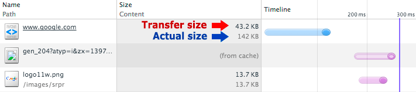

<style>
h1 {
    color:white;
    background:#7ab6df;
    width:100%;
    padding-left:0.5em;
    padding:auto;
    font-size:3em;
    font-weight:bold;
    letter-spacing:0.01em
 }
h2 {
    color:#7ab6df;
    background:#ffffff;
    font-weight:bold;
    width:100%;
    padding:5px;
    font-size:30px;
    letter-spacing:0.01em;
    border-bottom:1px solid #7ab6df!important;
    margin-top: 40px;
    margin-bottom:40px;
}
h3 {
    color:#7ab6df;
    background:#ffffff;
    width:100%;
    padding:3px;
    font-size:20px;
    font-weight:bold;
    border-bottom:1px solid #7ab6df!important;
    letter-spacing:0.01em;
}
pre {
    background:#e1f0fa!important;
    border: 1px solid #8ac6ef
}
code {
    color:#222;
    font-size:1em;
    font-weight:300;
}

blockquote {
    padding: 1em!important;
    color: #000!important;
    border-left: 0.25em solid #ce7206!important;
    background:#fbebc0;
}
ul {margin:1em}
li{margin:0.5em}
</style>


# Optimización del ahorro de contenido

A diferencia de lo que sucede en los equipos de escritorio, las aplicaciones web no requieren un proceso de instalación independiente. Se introduce la URL y eso es todo. Esta es una función clave de la Web. No obstante, para que esto ocurra a menudo necesitamos obtener docenas, y a veces cientos, de recursos diferentes que pueden aumentar los megabytes de datos y deben combinarse en cientos de milisegundos para ofrecer la experiencia web que buscamos.

Lograr una experiencia web instantánea en vista de estos requisitos no es un tema menor y por ello es fundamental optimizar la eficacia del contenido: eliminar descargas innecesarias, optimizar la codificación de transferencia de cada recurso mediante diferentes técnicas de compresión y aprovechar el almacenamiento en caché, siempre que sea posible, para eliminar descargas redundantes.

## Eliminación de descargas innecesarias

* Haz un inventario de tus propios recursos y los de terceros en tus páginas.
* Mide el rendimiento de cada recurso: su valor y su rendimiento técnico.
* Determina si los recursos proporcionan suficiente valor.

Los recursos más rápidos y más optimizados son aquellos que no se envían. Debes eliminar los recursos innecesarios en tu app. Te recomendamos que cuestionar y volver a visitar periódicamente las suposiciones implícitas y explícitas con tu equipo. He aquí algunos ejemplos:

* Siempre incluiste el recurso X en tus páginas; pero, ¿el valor que ofrece al usuario compensa el costo de su descarga y visualización? ¿Puedes calcular y probar su valor?

* ¿El recurso (en especial si es de terceros) proporciona un rendimiento uniforme? ¿Se encuentra, o debe encontrarse, este en la ruta de acceso crítica? Si el recurso se encuentra en la ruta de acceso crítica, ¿podría ser un único punto de error para el sitio? Es decir, si el recurso no está disponible, ¿afectará el rendimiento y la experiencia del usuario en tus páginas?

* ¿Tiene o necesita este recurso un SLA? ¿Sigue este recurso las prácticas recomendadas de rendimiento (compresión, almacenamiento en caché, etc.)?

Con frecuencia, las páginas contienen recursos que son innecesarios, o lo que es peor, afectan al rendimiento de la página sin brindar demasiado valor al visitante o al sitio en el que se alojan. Esto se aplica de la misma manera para recursos y widgets propios y de terceros:

* Para el sitio A se decidió mostrar un carrusel de fotos en la página principal a fin de permitir que el visitante obtenga una vista previa de varias fotos con un clic rápido. Todas las fotos se cargan cuando se carga la página y el usuario pasa las fotos.

* Pregunta: ¿mediste la cantidad de usuarios que visualizan varias fotos en el carrusel? Podrías generar una gran sobrecarga al descargar recursos que la mayoría de los visitantes nunca ven.

* Para el sitio B se decidió instalar un widget de terceros a fin de mostrar contenido relacionado, mejorar la participación social o proporcionar algún otro servicio.

* Pregunta:¿realizaste un seguimiento de la cantidad de visitantes que usan el widget o hacen clic en el contenido proporcionado por este? ¿El atractivo generado por este widget es suficiente como para justificar su sobrecarga?
    
Determinar si se eliminan las descargas innecesarias por lo general requiere de mucho tiempo de análisis cuidadoso y mediciones. Para obtener mejores resultados, realiza un inventario y repasa periódicamente estas preguntas correspondientes a cada recurso en tus páginas.

<br><br>

## Optimización de la codificación y el tamaño de transferencia e recursos basados en texto

Después de eliminar las descargas de recursos innecesarios, lo mejor que puedes hacer para mejorar la velocidad de carga de la página es minimizar el tamaño general de las descargas optimizando y comprimiendo los recursos restantes

### Compresión de datos 101

Una vez que hayas eliminado los recursos innecesarios, el siguiente paso será comprimir los recursos restantes que el navegador debe descargar. Según el tipo de recurso texto —imágenes, fuentes, etc.—, disponemos de varias técnicas diferentes: herramientas genéricas que se pueden habilitar en el servidor, optimizaciones previas al procesamiento para tipos de contenido específicos y optimizaciones específicas para los recursos que requieren la intervención del programador.

Para proporcionar el mejor rendimiento, se debe combinar todas esas técnicas.

* La compresión es el proceso de codificación de información mediante el uso de pocos bits.
* La eliminación de datos innecesarios siempre proporciona los mejores resultados.
* Existe una gran cantidad de técnicas y algoritmos de compresión diferentes.
* Necesitarás diferentes técnicas para lograr la mejor compresión.


El proceso de reducción del tamaño de los datos se conoce como compresión de datos. Muchas personas han dedicado toda su carrera a trabajar en algoritmos, técnicas y optimizaciones para mejorar las relaciones de compresión, la velocidad y los requisitos de memoria de varios compresores. El tratamiento de la compresión de datos en detalle está fuera del alcance de este tema. Sin embargo, es importante comprender en profundidad el funcionamiento de la compresión y las técnicas con las que cuentas para reducir el tamaño de varios recursos que tus páginas necesitan.

Para ilustrar los principios centrales de estas técnicas, considera el proceso para optimizar el formato simple de un mensaje de texto que se inventó para este ejemplo:

```
# Below is a secret message, which consists of a set of headers in
# key-value format followed by a newline and the encrypted message.
format: secret-cipher
date: 08/25/16
AAAZZBBBBEEEMMM EEETTTAAA
```

1. Los mensajes pueden contener anotaciones arbitrarias que se indican mediante el prefijo “#”. Las anotaciones no afectan el significado ni otros comportamientos del mensaje.
1. Los mensajes pueden contener “encabezados” que son pares clave-valor (separados por “:”) y aparecen al comienzo del mensaje.
1. Los mensajes pueden presentar cargas de texto.

¿Qué podrías hacer para reducir el tamaño del mensaje anterior, que actualmente tiene 200 caracteres?

1. El comentario es interesante pero en realidad no afecta el significado del mensaje. Elimínalo cuando transmites el mensaje.
1. Existen buenas técnicas para codificar encabezados de forma eficaz. Por ejemplo, si sabes que todos los mensajes tienen “formato” y “fecha”, podrías convertirlos en ID enteros cortos y enviar esos ID. Dicho esto, no estamos seguros de que este sea el caso y por ello hazlo a un lado por el momento.
1. La carga es solo texto y, si bien no sabemos cuál es su contenido (aparentemente, usa un “mensaje secreto”), con solo observar el texto nos damos cuenta de que contiene mucha redundancia. Quizá, en lugar de enviar letras repetidas, podrías contar la cantidad de letras repetidas y codificarlas de forma más eficaz. Por ejemplo, “AAA” se convierte en “3A”, que representa una secuencia de tres A.

La combinación de estas técnicas produce el siguiente resultado:

```
format: secret-cipher
date: 08/25/16
3A2Z4B3E3M 3E3T3A
```

El nuevo mensaje tiene 56 caracteres. Esto significa que has comprimido el mensaje original en un increíble 72%.

Todo esto es genial, pero ¿cómo nos ayuda a optimizar nuestras páginas web? No vamos a intentar inventar nuestros propios algoritmos de compresión. Sin embargo, como puedes ver, podemos usar las mismas técnicas y la misma forma de pensar para optimizar varios recursos en nuestras páginas: procesamiento previo, optimizaciones específicas para el contexto y diferentes algoritmos para diferente contenido.

## Minificación: procesamiento previo y optimizaciones específicas para el contexto

* Las optimizaciones de contenido específico pueden reducir notablemente el tamaño de los recursos proporcionados.
* Las optimizaciones de contenido específico se aplican mejor como parte de tu ciclo de compilación y lanzamiento.

La mejor manera de comprimir datos redundantes o innecesarios es eliminarlos. No podemos simplemente borrar datos arbitrarios. No obstante, en algunos contextos en los que podemos conocer el formato de los datos del contenido y sus propiedades en general se puede reducir notablemente el tamaño de la carga sin afectar su significado.

```
<html>
  <head>
  <style>
     /* awesome-container is only used on the landing page */
     .awesome-container { font-size: 120% }
     .awesome-container { width: 50% }
  </style>
 </head>

 <body>
   <!-- awesome container content: START -->
    <div>…</div>
   <!-- awesome container content: END -->
   <script>
     awesomeAnalytics(); // beacon conversion metrics
   </script>
 </body>
</html>
```
Considera la página HTML sencilla anterior y los tres tipos de contenido diferentes que contiene: lenguaje de marcado HTML, estilos CSS y JavaScript. Cada uno de estos tipos de contenido tiene diferentes reglas para lo que conforma el contenido válido, diferentes reglas para indicar comentarios, etc. ¿Cómo podemos reducir el tamaño de esta página?

* Los comentarios de código son el mejor amigo del programador, pero no es necesario que el navegador los vea. Con solo quitar los comentarios en CSS (/* … */), HTML (<!-- … -->) y JavaScript (// …) podemos reducir notablemente el tamaño total de la página.

* Un compresor de CSS “inteligente” podría detectar que usamos una técnica ineficaz para definir reglas de ‘.awesome-container’ y contraer las dos declaraciones para formar una sin afectar otros estilos, con lo cual se liberarán más bytes.

* Whitespace (espacios y pestañas) es una función conveniente para desarrolladores que trabajan con HTML, CSS y JavaScript. Un compresor adicional podría quitar todas las pestañas y los espacios.

```
<html><head><style>.awesome-container{font-size:120%;width: 50%}
</style></head><body><div>…</div><script>awesomeAnalytics();
</script></body></html>
```

Una vez aplicados los pasos anteriores, nuestra página pasa de 406 a 150 caracteres, lo que significa un ahorro del 63% en compresión. Concedido. No es muy legible, pero tampoco debe serlo: puedes conservar la página original como tu “versión de desarrollo” y luego aplicar los pasos anteriores cuando estés listo para lanzar la página en tu sitio web.

Demos un paso atrás. En el ejemplo anterior se ilustra un punto importante: un compresor multipropósito—digamos, uno diseñado para comprimir texto arbitrario—quizás podría hacer un buen trabajo de compresión de la página anterior, pero jamás podría tener capacidad para eliminar comentarios, contraer las reglas de CSS o hacer muchas otras optimizaciones específicas del contenido. Por eso el procesamiento previo, la minificación y la optimización pertinente al contenido pueden ser herramientas muy poderosas.

Nota: Un buen ejemplo es la versión de desarrollo sin compresión de la biblioteca JQuery, que se está acercando a los ~300 KB. La misma biblioteca, aunque reducida (sin comentarios, etc.) es aproximadamente 3 veces más pequeña: ~100 KB.

De igual manera, las técnicas anteriores se pueden extender más allá de los recursos basados en texto. Las imágenes, los videos y otros tipos de contenido tienen sus propias formas de metadatos y diferentes cargas. Por ejemplo, cada vez que sacas una foto con una cámara, la foto incorpora mucha información adicional: configuración de la cámara, ubicación, etc. Según la app, estos datos pueden ser críticos (por ejemplo, un sitio donde se comparten fotos) o completamente obsoletos y deberías considerar si vale la pena eliminarlos. En la práctica, estos metadatos pueden sumar decenas de kilobytes por cada imagen.

En pocas palabras, como primer paso en la optimización de la eficiencia de tus recursos, crea un inventario de los diferentes tipos de contenidos y considera las optimizaciones de contenido que puedes aplicar para reducir su tamaño. Luego, cuando determines cuáles son, automatiza esas optimizaciones agregándolas a tus procesos de compilación y lanzamiento. Es la única manera de garantizar que las optimizaciones perduren.


### Compresión de texto con GZIP

* GZIP ofrece el mejor rendimiento en recursos basados en texto: CSS, JavaScript, HTML.
* Todos los navegadores modernos admiten compresión GZIP y la solicitarán automáticamente.
* Tu servidor debe estar configurado para habilitar la compresión GZIP.
* Algunas CDN requieren atención especial para garantizar que la compresión GZIP esté habilitada.

GZIP es un compresor genérico que se puede aplicar a cualquier transmisión de bytes. De forma imperceptible, este recuerda el contenido que detectó anteriormente e intenta buscar y reemplazar fragmentos de datos duplicados de forma eficaz. (Si te interesa, puedes consultar esta excelente explicación simple de GZIP.) No obstante, en la práctica, GZIP ofrece mejores resultados con contenido basado en texto y generalmente alcanza índices de compresión del 70 al 90% para archivos más grandes, mientras que la ejecución de GZIP en recursos ya comprimidos mediante algoritmos alternativos (por ejemplo, la mayoría de los formatos de imagen) no ofrece un beneficio significativo.

Todos los navegadores modernos admiten y negocian automáticamente la compresión GZIP para todas las solicitudes HTTP. Debes garantizar que el servidor esté configurado correctamente para proporcionar el recurso comprimido cuando el cliente lo solicite.

El rango de ahorro en la compresión oscila entre el 60 y el 88%, y la combinación de los archivos reducidos (identificados con la extensión “.min” en sus nombres) con la compresión GZIP te brinda un ahorro mayor.

* Primero, aplica optimizaciones de contenido: minificadores CSS, JS y HTML.
* Aplica GZIP para comprimir el resultado minificado.

La habilitación de GZIP es una de las optimizaciones más sencillas y beneficiosas que se pueden implementar (lamentablemente, muchos se olvidan de hacerlo). La mayoría de los servidores web comprimen el contenido en tu nombre y solo deberás verificar que el servidor esté configurado correctamente para comprimir todos los tipos de contenido que se benefician con la compresión GZIP.

El proyecto HTML5 Boilerplate contiene ejemplos de archivos de configuración para todos los servidores más populares con comentarios detallados para cada marcador de configuración y cada ajuste. Para determinar cuál es la mejor configuración para tu servidor, haz lo siguiente: Encuentra tu servidor favorito en la lista. Busca la sección GZIP. * Confirma que tu servidor esté configurado con los ajustes recomendados.




Una forma rápida y simple de ver a GZIP en acción es abrir Chrome DevTools e inspeccionar la columna “Size/Content” en el panel Network: “Size” indica el tamaño de transferencia del recurso y “Content” el tamaño del recurso sin comprimir. Para el recurso HTML del ejemplo anterior, GZIP ahorró 98,8 KB durante la transferencia.

Nota: A veces, GZIP aumenta el tamaño del recurso. Generalmente, esto ocurre cuando el recurso es muy pequeño y la sobrecarga del diccionario de GZIP supera lo que se ahorra en la compresión o cuando el recurso ya está bien comprimido. Algunos servidores te permiten especificar un umbral de tamaño de archivo mínimo para evitar este problema.

Por último, si bien la mayoría de los servidores comprimen automáticamente los recursos al proporcionárselos a los usuarios, algunas CDN requieren especial atención y esfuerzo manual para garantizar que se proporcione el recurso GZIP. Audita tu sitio y asegúrate de que tus recursos se compriman.