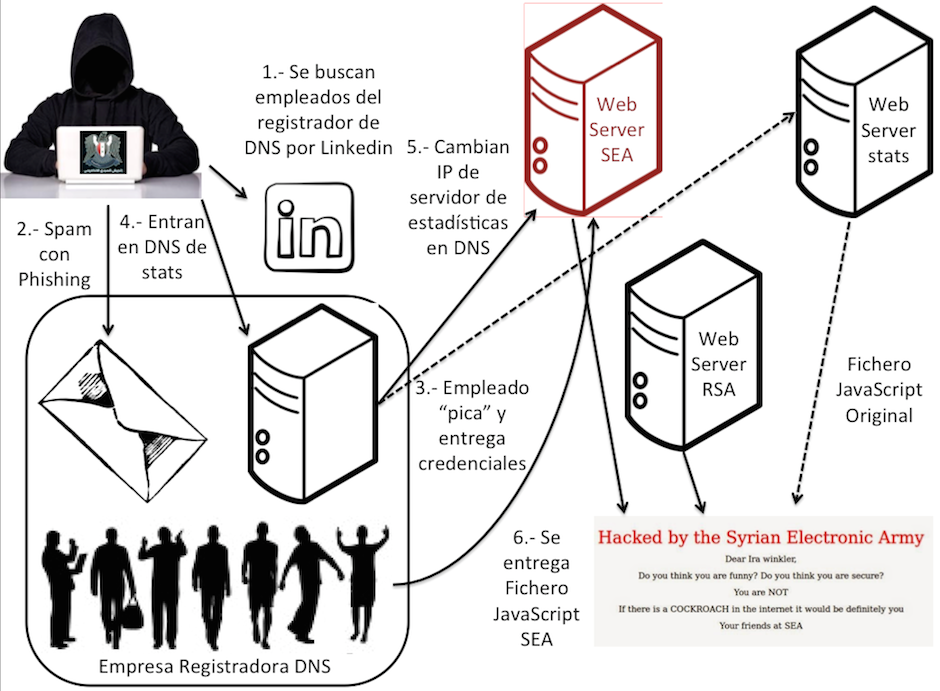
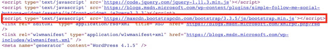
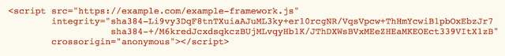
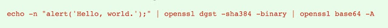
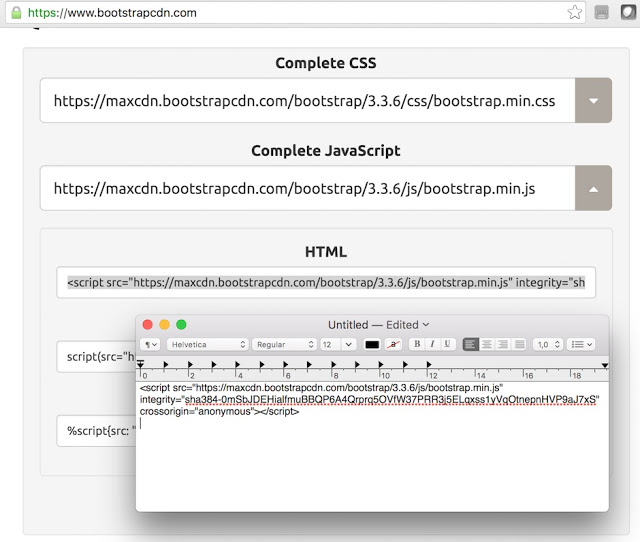
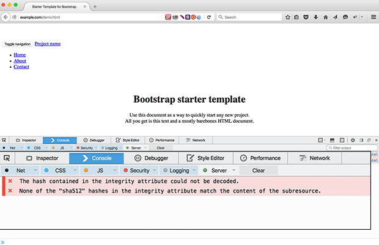

<style>
h1 {
    color:white;
    background:#7ab6df;
    width:100%;
    padding-left:0.5em;
    padding:auto;
    font-size:3em;
    font-weight:bold;
    letter-spacing:0.01em
 }
h2 {
    color:#7ab6df;
    background:#ffffff;
    font-weight:bold;
    width:100%;
    padding:5px;
    font-size:30px;
    letter-spacing:0.01em;
    border-bottom:1px solid #7ab6df!important;
    margin-top: 40px;
    margin-bottom:40px;
}
h3 {
    color:#7ab6df;
    background:#ffffff;
    width:100%;
    padding:3px;
    font-size:20px;
    font-weight:bold;
    border-bottom:1px solid #7ab6df!important;
    letter-spacing:0.01em;
}
pre {
    background:#e1f0fa!important;
    border: 1px solid #8ac6ef
}
code {
    color:#222;
    font-size:1em;
    font-weight:300;
}

blockquote {
    padding: 1em!important;
    color: #000!important;
    border-left: 0.25em solid #ce7206!important;
    background:#fbebc0;
}
ul {margin:1em}
li{margin:0.5em}
</style>


# **Vulnerabilidades genéricas en Frontend**

## **Cliente XSS**

En el Frontend, una vulnerabilidad de 'Cross-Site Scripting' ocurre cuando se envían datos dinámicos a un usuario sin ser validados como contenido malintencionado. 

La mayoría de las veces, las vulnerabilidades de XSS se producen cuando los sitios web o las aplicaciones no eliminan el código ejecutable de los campos de entrada a los que tienen acceso sus usuarios. Por ejemplo, un desarrollador web que trabaje en una aplicación de uso compartido de fotos debe asegurarse que sólo se pueden cargar imágenes en los campos necesarios y que esos campos de imagen eliminen vínculos rotos, extensiones de archivo incorrectas y código malicioso.

### **¿Cómo se protege contra XSS?**
Comienza por utilizar marcos y servicios que han construido protección contra este tipo de ataques. 
Más información sobre la protección contra XSS:

[https://www.owasp.org/index.php/Special:Search/Cross-site_Scripting_(XSS](https://www.owasp.org/index.php/Special:Search/Cross-site_Scripting_(XSS)

## **Iframes**

Los iframes han existido desde hace bastante tiempo, y tienen varios casos de uso diferentes. También pueden causar muchos problemas. Es importante recordar que mostrar contenido dentro de un Iframe significa que confía en que el contenido no sea vulnerable o malicioso. Los iframes y los ataques XSS suelen ir de la mano, lo que significa que el contenido malicioso dentro de un Iframe puede seguir afectando a tus usuarios. Si el contenido dentro del Iframe viene de tu dominio, es importante asegurarse de que el contenido del iframe es seguro y no vulnerable a un ataque.

Afortunadamente existe una gran manera de proteger contra estas vulnerabilidades usando el atributo `sandbox`.

[http://www.html5rocks.com/en/tutorials/security/sandboxed-iframes/](http://www.html5rocks.com/en/tutorials/security/sandboxed-iframes/)


## **CORS**

Si alguna vez has querido compartir recursos entre subdominios, es muy probable que hayas tenido que lidiar con el uso compartido de recursos de origen cruzado. Cuando CORS se utiliza de forma irresponsable, puede permitir que cualquiera envíe una solicitud a su servidor, revelando información sensible en la respuesta. Si alguna vez ha establecido Access-Control-Allow-Origin en *, vale la pena asegurarse de que no ha comprometido su sitio.

[https://code.google.com/archive/p/html5security/wikis/CrossOriginRequestSecurity.wiki](https://code.google.com/archive/p/html5security/wikis/CrossOriginRequestSecurity.wiki) 


## **Cookies**

Las bibliotecas como `jQuery Cookie` hacen que sea muy fácil establecer cookies sin tener que depender de un servidor. Cuando se trabaja con cookies, es importante recordar que pueden estar expuestas a las vulnerabilidades de XSS y CORS. Ademas no están cifradas de manera predeterminada, lo que significa que una contraseña almacenada en una cookie sobre http se almacenará en texto plano. Asegúrese de revisar este tutorial de Treehouse, que proporciona una lista de maneras de hacer que sus cookies sean más seguras.

[Http://blog.teamtreehouse.com/how-to-create-totally-secure-cookies](http://blog.teamtreehouse.com/how-to-create-totally-secure-cookies)

## **Seguridad de Frontend y HTML5**

Se sabe que los elementos HTML5 y los APIs muestran vulnerabilidades de seguridad cada cierto tiempo. Aunque los navegadores son rápidos en implementar correcciones, siempre es una buena idea tener esto en cuenta al trabajar con contenido sensible. Html5sec.org proporciona una visión general de las vulnerabilidades de los elementos HTML5, junto con las versiones del navegador que son vulnerables a ellos.

[Https://html5sec.org/](https://html5sec.org/)

<hr>

# **Principales riesgos de la aplicación web**

1. Inyección **
2. Autenticación rota y gestión de sesión ***
3. Scripting entre sitios (XSS) ***
4. Referencias de objeto directo inseguro **
5. Desconfiguración de seguridad **
6. Exposición de datos sensibles *****
7. Falta el control de acceso del nivel de la función *****
8. Cross-Site Request Falsión (CSRF) *
9. Uso de componentes con vulnerabilidades conocidas ****
10. Redireccionamiento y Forwards no validados ***

\***** Mas crítico <br>
\**** <br>
\*** <br>
\** <br>
\* Menos crítico

<hr>

## **Ataques comunes en el Frontend**

1. Interpretación errónea de URL.
2. Navegación en el directorio.
3. Recuperación de archivos "no-web".
4. Reverse Proxying.
5. Decompilación de Java.
6. Divulgación del código fuente.
7. Validación de entrada.
8. Envenenamiento de consultas SQL.
9. Secuestro de sesión.
10. Desbordamientos del búfer.

 <hr>
 
## **Vulnerabilidades en AngularJS**
Como cualquier otra tecnología, AngularJs no es impermeable al ataque. AngularJS, sin embargo, incorpora protección de los agujeros de seguridad básicos, incluyendo una recopilación de sitios cruzados y de los ataques de inyección de HTML. Angular JS escapa todas las cadenas de ida y de vuelta e incluso ofrece protección XSRF para la comunicación del lado del servidor.

[http://www.slideshare.net/kevinhakanson/ng-owasp-ndc](http://www.slideshare.net/kevinhakanson/ng-owasp-ndc)

OWASP Top 10 for AngularJS Applications: [https://github.com/hakanson/ng-owasp](https://github.com/hakanson/ng-owasp)

## **1. Inyección**

### **$Sanitize**

el módulo `ngSanitize` proporciona funcionalidad para usar el mecanismo sanitize.
Para poder insertar HTML existe el mecanismo "sanitize". Para poder utilizarlo, hay que hacer referencia al script y a comtinuacion declarar una dependencia desde el mdulo principal hacia el módulo `ngSanitize`.

    ```
    js
    <script src="angular-sanitize.js"></script>

    angular.module('app', ['ngSanitize']);
    ```

El modulo `ngSanitize` contiene la directiva `ngBindHtml` que permite a partir de una propiedad del modelo que contenga codigo HTML inyectar ese código.
    
    ```
    <div data-ng-bind-html="content"></div>    
    ```

Antes de insertar el código HTML el mecanismo de 'sanitize' verificará y eliminará todos los elementos potencialmente peligrosos, en particular los
scripts javascript.

Para forzar a 'sanitize' a no verificar el código HTML, se usa el servicio `$sce`, que permite marcar el contenido como válido, invocando al método `TrustAsHtml`.

> **__Importante__**: Tenga en cuenta que marcar los datos no confiables como seguros a través de llamadas a `$sce.trustAsHtml`, etc. es peligroso y conducirá a vulnerabilidades 'Cross Site Scripting'.

### **Otras reglas a tener en cuenta**

    * El servicio `$interpolate` es usado por el servicio `$compile` para data-binding.
    * Diseña la aplicación de tal manera que los usuarios no puedan cambiar las plantillas del cliente.
    * No mezcles plantillas de cliente y servidor.
    * No utilices la entrada del usuario para generar plantillas dinámicamente.
    * No ejecutes la entrada de usuario a través de $scope.$Eval

### **Angular-translate**

        $translateProvider.useSanitizeValueStrategy([1,2,3,4]) 

        1. **sanitize** (desinfecta HTML en el texto de traducción usando $sanitize).
        2. **escape** (escapa HTML en la traducción).
        3. **sanitizeParameters** (desinfecta HTML en el valor de los parámetros de interpolación usando `$sanitize`).
        4. **escapeParameters** (escapa HTML en los valores de los parámetros de interpolación).

### Ejemplo

        ```js
        $translateProvider.translations('en', {
            GREETING: '<b>hello</b> {{name}}',
            GREETINGGX: '<b>hello</b> {{name | uppercase}}'
        });
        $translateProvider.useSanitizeValueStrategy('sanitize');
        ```


## **2. Autenticación rota y administración de sesión**

* Utiliza interceptores para identificar el estado de inicio de sesión de usuario y reacciona dependiendo del estado de respuesta de la Api.
* Borra los datos de usuario cuando la Api cierre la sesión del usuario.

## **3. Cross-Site-Scripting**
Significa que el atacante puede insertar código javascript personalizado que luego se muestra en el navegador de usuario.

### **Descripción de los tres tipos existentes**

* <b>stored</b> * (La entrada de código javascript se produce en un campo -> DB -> enviado de nuevo a la página).
* <b>reflected</b> *** (La entrada de código javascript se produce en la url, envio de la url al usuario, js ejecutado).
* <b>DOM-based</b> ***** (La entrada activa la lógica del código javascripts que manipula el DOM e inserta javascript personalizado).

> Recuerda: cualquier entrada externa es **__NO CONFIABLE!__**.<br>Debemos evitar mezclar la entrada del usuario con el código js.

###  **Prevención**

* Desde AngularJS 1.3, el compilador HTML escapará por omisión todos los '{{}}' y 'ng-bind'.
* Usa `$sceProvider` y `$SanitizeProvider`.
* La Política de seguridad de contenido (CSP) es una capa añadida de seguridad que ayuda a detectar y mitigar ciertos tipos de ataques, incluidos los ataques XSS y de inyección de datos.
* Compatibilidad CSP [http://caniuse.com/#feat=contentsecuritypolicy](http://caniuse.com/#feat=contentsecuritypolicy).
* NgCsp es un módulo de AngularJS que permite el soporte CSP.
* Usar SRI (Subresource Integrity), tal como recomienda W3C.

> Cuando este modo está activado, AngularJS evalúa todas las expresiones hasta un 30% más lento que en modo no CSP, pero no se generarán violaciones de seguridad.

```html
<!doctype html>
<html ng-app ng-csp>
...
...
</html> 
```
### **Usar SRI (Subresource Integrity), tal como recomienda W3C.**
La propuesta es bastante sencilla y se basa en añadir a las etiquetas de link o de script dos nuevos campos, que son el campo integrity y el campo crossorigin para verificar que el archivo que se está cargando no ha sido manipulado y que es el mismo que se utilizó en la fase de creación de la web y que se cumple la política de seguridad CORS (Cross-Origin Resource Sharing) que llevan los navegadores.


Supongamos que tenemos una web a la que llamaremos WEB_A y queremos cargar un Script_JS en ella que está publicado en la WEB_B. Es decir, que en algún lugar en la WEB_A tenemos una entrada SCRIPT SRC=WEB_B/Script_JS. Si un atacante vulnera la seguridad de la WEB_B y cambia el Script_JS, entonces todos los navegantes de la WEB_A verán en riesgo su seguridad. Esto es lo que sucedió, por ejemplo, en el ataque a la web de la RSA Conference hace un par de años.




Pero esto se puede proteger con SRI. Veamos un ejemplo con los blogs MSDN de Microsoft. En este caso, los Blogs MSDN de Microsoft cargan un script d la web de una CDN, en este caso de BootStrapCDN.com



Si alguien, como sucedió en el pasado con esta misma CDN, es capaz de manipular el contenido del script que va en el código, entonces todos los visitantes de los blogs de MSDN de Microsoft podrán ser atacados por malvertesing o por exploits que afecten a la seguridad de los equipos de los clientes y a la reputación del sitio.

#### **Configuración de SRI en etiqueta Script**

Sin embargo, según indica SRI, la inclusión de ese recurso podría hacerse de manera segura si en la etiqueta script que utiliza la web de los blogs MSDN de Microsoft se añaden las etiquetas integrity y crossorigin. Para ello, el desarrollador de la web primeramente genera el hash del archivo que quiere cargar con un algoritmo SHA-2 y lo codifica en Base64. Ese valor, precedido por el algoritmo que se ha utilizado para hacer el hash se añade a la etiqueta integrity. La opción de crossorigin debe seguir la política CORs de la web que se haya configurado.



Esto se puede calcular de muchas formas y en la misma especificación de SRI se muestra un ejemplo de cómo hacerlo con OpenSSL. 



En el caso concreto de BootStrapCDN, en la web donde se publica el fichero JavaScript que debe ser cargado para sacar provecho de sus servicios se da directamente el hash que se debe utilizar para hacer la carga segura, algo que no se está utilizando en los blogs MSDN de Microsoft.



Una vez que se ha integrado en la web el recurso protegido con la opción integrity de SRI, el navegador comprobará el hash del fichero recibido antes de ser ejecutado o incluido en la web, por lo que si hubiera sido manipulado o cambiado el archivo a cargar, el navegador generaría una excepción y no lo cargaría.



De esta forma la carga de contenido de terceros en tu web estaría hecha de una forma más robusta, protegiendo la seguridad de los clientes que visiten tu web aún cuando los proveedores de contenido hayan sido vulnerados. Por ahora, no todos los navegadores implementan esta protección, pero es conveniente que vayas "hasheando" los archivos que cargas remotamente.

```html
<script src="alert.js"
    integrity="sha256-quigoirbgosdnfdsklfjsdklfhjurf/Tng="
    crossorigin="anonymous"></script> 
``` 
> esto evitará algunas cosas como:
```js
document.body.appendChild(document.createElement("script"))
.appendChild(document.createTextNode("alert('xss')"))
```

## **4. Exposición de datos sensibles**

* El módulo `ngStore` contiene servicios que proporcionan acceso al almacenamiento local de "disco" proporcionado por las API del navegador nativo, como 'localStorage', 'sessionStorage' e 'IndexedDB'. Todos los servicios dentro del módulo `ngStore` soportarán el cifrado, administrado a través del servicio `$localDB`.
* Angular-cache un reemplazo muy útil para `$cacheFactory` de AngularJS. El modo de almacenamiento de una caché puede ser "memoria", "localStorage", "sessionStorage" o una implementación personalizada.

### **¿Cuándo se borra el almacenamiento?**

* <b>Variable / memoria</b> - cuando la página se cierra.
* <b>Cookie de sesión</b> - cuando el navegador se cierra.
* <b>SessionStorage</b> - cuando el navegador se cierra.
* <b>Cookie persistente</b> - cuando caduca.
* <b>LocalStorage</b> - cuando se borra la explicidad.
* <b>IndexedDB</b> - cuando se borra explícitamente.

Los atacantes con acceso local pueden recuperar datos confidenciales de esta caché incluso cuando los usuarios no están autenticados.
Por ejemplo, en una Aplicación de una sola página (SPA) de larga duración, un usuario puede "desconectarse", pero entonces otro usuario puede acceder a la aplicación sin actualizar, en cuyo caso todos los datos almacenados en caché están disponibles.

>Recuerda que debes borrar todos los datos sensibles después de cerrar la sesión.

[https://www.whitehatsec.com/blog/web-storage-security/](https://www.whitehatsec.com/blog/web-storage-security/)

## **5. Tokens e interceptores**

* Pasar token de autenticación en cada solicitud HTTP (interceptores y $resource).
* JWT en angular [http://github.com/auth0/angular-jwt](http://github.com/auth0/angular-jwt) Almacenamiento y recuperación de tokens en el cliente

### Gestión de tokens
```js
$http(...).then(function(response) {
    currentToken.jwt = response.data.access_token;
})

tokenPayload = jwtHelper.decodeToken(jwt);
date = jwtHelper.getTokenExpirationDate(jwt);
bool = jwtHelper.isTokenExpired(jwt);
```

### **Enviando Tokens**
* Cookies
    *Pros
        * Enviado automáticamente
        * No se requiere código en el cliente
    *Contras
        * Enviado automáticamente
        * Incluso cuando no quería
        * Menos control sobre la validez
        * Almacenado en el disco del cliente
* Headers
    *Pros
        * Enviado sólo de forma explícita
        * No almacenado en el disco a menos que quieras
        * Más control
        * También previene CSRF
    *Cons
        * Requiere código en el lado del cliente, aunque esto es normal en SPA

### **Almacenadndo tokens**

En memoria o sessionStorage:
    * Solo funciona en la pestaña actual
    * Cerrado automáticamente

En localStorage:
    * Persistente
    * Trabaja en varias pestañas
    * Requiere expiración explícita

[http://stormpath.com/blog/where-to-store-your-jwts-cookies-vs-html5-web-storage](http://stormpath.com/blog/where-to-store-your-jwts-cookies-vs-html5-web-storage)

### **Recomendaciones de enrutamiento para auth**
* Redirigir al inicio de sesión si no está autenticado.
* Redireccionar al inicio de sesión si el token ha caducado.
* Opcionalmente, redirigir de nuevo a URL original.
* Redireccionar a la página de error si la ruta no está autorizada en el perfil actual.
* Utilice uiRoute en lugar de ngRoute, pues ofrece más capacidades.

## **6. Uso de componentes con vulnerabilidades conocidas**
Los componentes, como bibliotecas, frameworks y otros módulos de software, casi siempre se ejecutan con todos los privilegios. Si un componente vulnerable es explotado, un ataque de este tipo puede facilitar la pérdida de datos graves o la toma de control del servidor. Las aplicaciones que utilizan componentes con vulnerabilidades conocidas pueden socavar las defensas de las aplicaciones y permitir una serie de posibles ataques e impactos.

### **retire.js** 

Retire.js tiene estas partes:

### **Escáner de línea de comandos**
Escanea una aplicación web o una aplicación de node para utilizar bibliotecas de JavaScript y/o módulos de node vulnerables.

### **Grunt plugin**
Grunt-retire escanea tu aplicación activada por grunt para el uso de bibliotecas de JavaScript y/o módulos de node vulnerables.

### **Extensiones para Chrome y Firefox**
Escanea sitios visitados para referencias a bibliotecas inseguras y pone advertencias en la consola del desarrollador. También se mostrará un icono en la barra de direcciones si se cargaran bibliotecas vulnerables.

### **Burp y complementos OWASP ZAP**
Retire.js ha sido adaptado como plugin para las herramientas de pruebas de penetración Burp y OWASP ZAP.

### **Vulnerabilidades**
Estas son las vulnerabilidades detectadas actualmente por Retire.js


## **7. Utilice el último AngularJS posible**
Al igual que cualquier biblioteca de software, es crítico mantener a AngularJS al día. Por favor, revisa el CHANGELOG y asegúrate de estar al tanto de los próximos parches de seguridad y otras actualizaciones.


## **8. Error de configuración de seguridad**
* Hombre en el medio. HTTPS EN TODO LUGAR
* Tenga cuidado con CORS. Evita Allow-Origin "*" a menos que tengas una autenticación y autorización muy fuertes.
* Recuerda decirle al navegador que permita una protección más fuerte. Https://www.owasp.org/index.php/List_of_useful_HTTP_headers


## **9. Protección de Vulnerabilidad de JSON**
Una vulnerabilidad de JSON permite que un sitio web de terceros convierta su URL de recursos JSON en solicitud JSONP bajo ciertas condiciones. Para contrarrestar esto, su servidor puede prefijar todas las peticiones JSON con la siguiente cadena ")]} ', \ n". AngularJS eliminará automáticamente el prefijo antes de procesarlo como JSON.


Por ejmeplo si necesitamos deveolver:
```
['one','two']
```
lo cual es vulnerable a un ataque, nuestro serrvidor podría devolver:
```
)]}',
['one','two']
```
AngularJS eliminará el prefijo, antes de procesar el JSON.<br>

Tenga en cuenta que llamar $http.jsonp, como en nuestro ejemplo de 'Yahoo Finences', le da al servidor remoto (y, si la solicitud no está asegurada, a cualquier atacante Man-in-the-Middle) ejecución de código remota instantánea en su aplicación: El resultado de estas solicitudes se transmite al navegador como etiqueta regular.

## **Links de interés**
* [https://www.owasp.org/index.php/Main_Page](https://www.owasp.org/index.php/Main_Page)
* [OWSAP Secure Coding Principles](http://image.slidesharecdn.com/cloudconf-2015-bonamico-angular-security-full-151022072800-lva1-app6892/95/angularjs-security-defend-your-single-page-application-66-1024.jpg?cb=1445499026)
* [OWASP Testing Guide](http://image.slidesharecdn.com/cloudconf-2015-bonamico-angular-security-full-151022072800-lva1-app6892/95/angularjs-security-defend-your-single-page-application-66-1024.jpg?cb=1445499026)
* [SOLID Desing Principles](http://image.slidesharecdn.com/cloudconf-2015-bonamico-angular-security-full-151022072800-lva1-app6892/95/angularjs-security-defend-your-single-page-application-66-1024.jpg?cb=1445499026)
* [Attack Vectors & Vulnerabilities](http://image.slidesharecdn.com/cloudconf-2015-bonamico-angular-security-full-151022072800-lva1-app6892/95/angularjs-security-defend-your-single-page-application-67-1024.jpg?cb=1445499026)
* [OWASP Guidelines](http://image.slidesharecdn.com/cloudconf-2015-bonamico-angular-security-full-151022072800-lva1-app6892/95/angularjs-security-defend-your-single-page-application-67-1024.jpg?cb=1445499026)
* [JS Frameworks Security](http://image.slidesharecdn.com/cloudconf-2015-bonamico-angular-security-full-151022072800-lva1-app6892/95/angularjs-security-defend-your-single-page-application-67-1024.jpg?cb=1445499026)
* [Slides Carlo Bonamico](http://es.slideshare.net/carlo.bonamico/angularjs-security-defend-your-single-page-application)